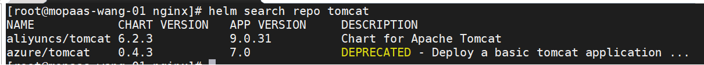
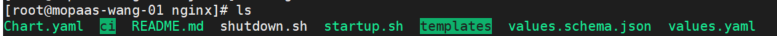

# 通过shell脚本操作helm部署应用  
  
> 背景    
> 通过helm-chart部署应用到kubernetes  
  
## 1、通过helm添加相应的源  
  
```shell
   helm repo add aliyuncs https://apphub.aliyuncs.com/
   helm repo add azure http://mirror.azure.cn/kubernetes/charts/
   helm repo add elastic https://helm.elastic.co  
```  
  
## 2、查询要部署的应用 --以tomcat为列  
  
```shell
    helm search repo tomcat
```   
  
  
## 3、执行脚本文件拉取应用yaml等配置   
  
```shell
    sh test.sh -i  aliyuncs/tomcat -v 6.2.3 -n test
```  
> -i : 表示镜像image   
> -v : chart对应镜像的版本    
> -n : namespace 不传参数时表示默认default命名空间       
> 
> 执行成功后可以在当前目录下看到一个tomcat文件   
> 文件中有tomcat的一些配置yaml     
> 下载的文件中有一个启动脚本，配置values.yaml参数  
>   
#### 具体参数详情可以参考根目录下的```README.md```
  
## 4、配置好参数后启动项目  
> 在项目的根目录下有一个启动脚本，执行脚本即可  

  
   
```shell
   sh startup.sh
```  
  
## shell内容  
  
```shell
   #!/bin/bash

    # 创建异常函数
    error_exit ()
    {
      echo "ERROR: $1 !!" 
      exit 1  
    }
    success_exit ()
    {
       echo "SUCCESSSFUL !!  $1 "
    }
    
    # 获取部署名称
    
    deploy_name=""
    version=""
    namespace=""
    while getopts ":i:v:n:" opt
    do
       case $opt in
         i)
            echo "the image is $OPTARG"
            deploy_name=$OPTARG 
            ;;
         v)
            echo "the version is $OPTARG"
            version=$OPTARG 
            ;;
         n)
            echo "the namespace is $OPTARG"
            namespace=$OPTARG
            ;;
         ?)
           echo "opt $opt OPT : $OPTARG"
           error_exit "Parameters can only be image 、namespace and version"
           exit 1
           ;;
        esac
    done
    
    # echo $deploy_name
    # echo $version
    # 验证部署名称是否为空
    if [ -z $deploy_name ]
    then
      error_exit "The deployment name cannot be empty"
    fi
    
    # 获取下载的报名前缀
    name=${deploy_name#*/}
    
    result=""
    while [[ "$result" == "" || -z $result ]]
    do
       tmp=${name#*/}
       name=$tmp
       result=$name
    done
    
    # 操作helm拉取相对应的部署yaml文件
    dir=`cd $(dirname $0)`
    if [ -z $namespace ]
    then
      echo "the namspece is empty"
      `cd $(dirname $0); helm fetch "$deploy_name" --version $version;`
    else
       `cd $(dirname $0); helm fetch "$deploy_name" --version $version -n $namespace;`
    fi
    ` tar -zxvf ${name}*.tgz; rm -fr ${name}*.tgz;`
    ` chmod -R 777 ${name}* `
    
    success_exit "pull $name success"
    
    # 创建启动文件
    uuid=`cat /proc/sys/kernel/random/uuid`
    install="\`helm install ${name} ../${name} --set imageTag=${version} --namespace=${namespace}\`"
    if [ -z $namespace ]
    then
       install="\`helm install ${name} ../${name} --set imageTag=${version}\`"
    fi
    # echo "install : ${install}"
    # echo "uuid : $uuid"
    `cd $(dirname $0)/${name}; echo "#!/bin/bash" >> startup.sh`
    `cd $(dirname $0)/${name}; echo "${install}" >> startup.sh ;chmod -R 777 startup.sh`
    
    # 创建结束脚本
    `cd $(dirname $0)/${name}; echo "#!/bin/bash" >> shutdown.sh`


```

  
